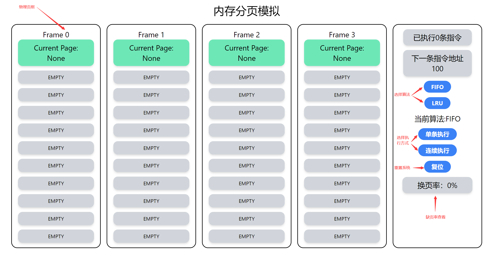
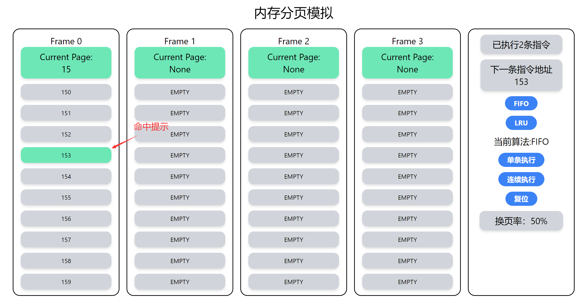
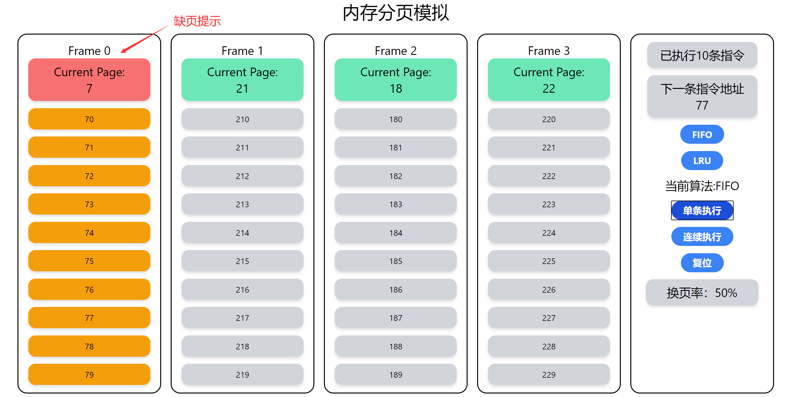
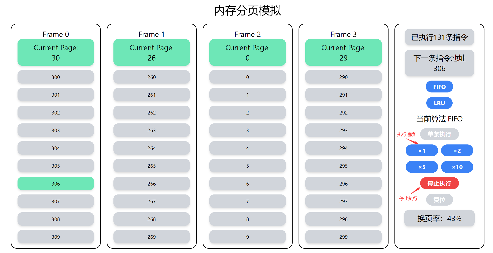
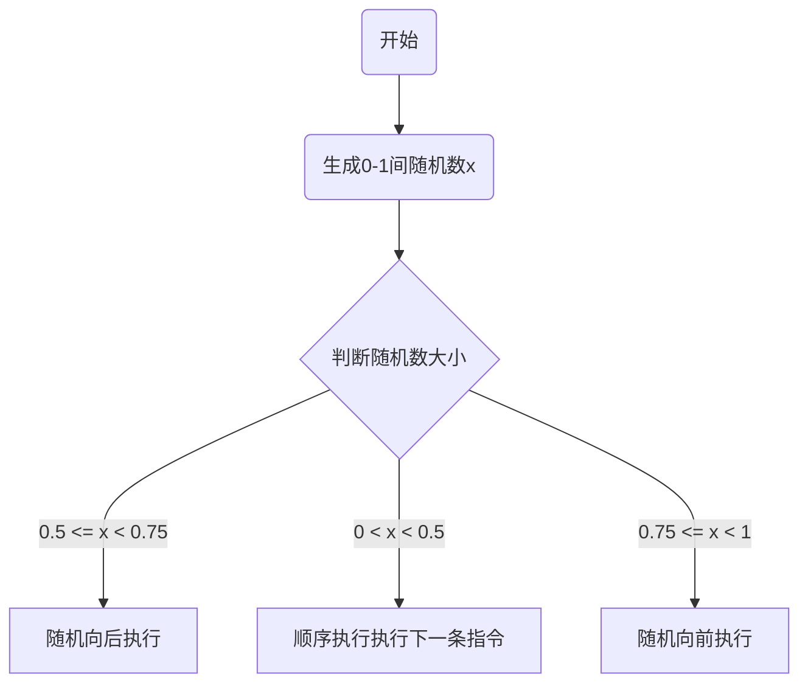

# 内存管理作业
<center>任致辰 1850091</center>

## 项目介绍

本项目为一个内存调页模拟程序。在本项目所模拟的系统中，执行程序共有320条指令。一页可以存放10条指令，所有指令被分为32页，系统中共有4个页框可供程序使用。本项目将展示程序执行过程中的换页过程，以及缺页率的统计。


## 运行方法

```bash
git clone https://github.com/ZhichenRen/Memory-Management.git
cd Memory-Management
yarn install
yarn serve
```

本项目已在Github Page上部署，<a href="zhichenren.github.io/Memory-Management" style="text-decoration: none;font-weight: bold; color: black;">点击访问</a>。

## 功能说明

​		本项目实现了如下功能：

- 指令执行条数查看
- 下一条指令地址查看
- 单步执行指令
- 连续执行指令
- 指令命中提示
- 缺页提示
- 缺页率统计

</img>

<center>总览</center>



<center>指令在页中</center>



<center>缺页提示</center>



<center>连续执行</center>

## 实现介绍

本项目的核心部分是后继指令地址的生成与替换算法的实现，下面简要说明。

### 后继指令生成

本项目遵循50%顺序执行下一条指令，25%执行当前指令前的指令，25%执行当前指令后的指令的指令分布，采用随机的方式执行指令。



### FIFO算法实现

程序中维护一个数组 ***call_in_time*** ，用于存放每个页框中的页的换入时间戳，当发生缺页时，程序遍历每一个页框，选择时间戳最小，也就是最早调入的页换出。

### LRU算法实现

程序中维护一个数组 ***priority*** 来表示各页的换出优先级，数值较大的页优先被换出，具体更新策略如下：

- 当一个新的页被换入时，更新其 ***priority*** 为0
- 当一个已被调入的页被访问时，更新其 ***priority*** 为0
- 每次新执行一条指令时，令所有被调入的页的 ***priority*** 增加1

从上述更新策略中可以看出，长时间未访问的页的 ***priority*** 值较大，而近期换入或访问的页的 ***priority*** 值较小，在进行替换时前者更有可能被换出。
